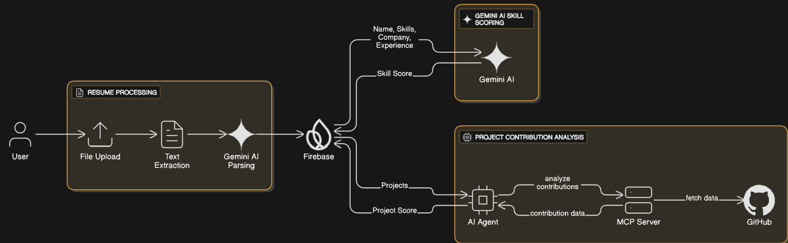

“HireLens” → evokes the idea of a lens that helps recruiters “see clearly” into a candidate’s real potential — their skills, experience, and contributions.

## Overview:
Users upload their resumes, where text is extracted and analyzed by Gemini AI to identify key details like Name, Skills, Experience, Company, and Projects. The structured output is stored in Firebase as a JSON document for further evaluation.

Based on the stored data, Gemini AI generates a Skill Assessment Score using the user’s skills, experience, and company background. A custom AI agent then evaluates the user’s GitHub project contributions via an MCP server to compute a Project Contribution Score, providing an intelligent and data-driven overview of a candidate’s professional capabilities.

## Architecture:

## Working:

1. run npm start to initialize the react app.
2. run the main.py file to initialize the AI Agent for MCP servers.

